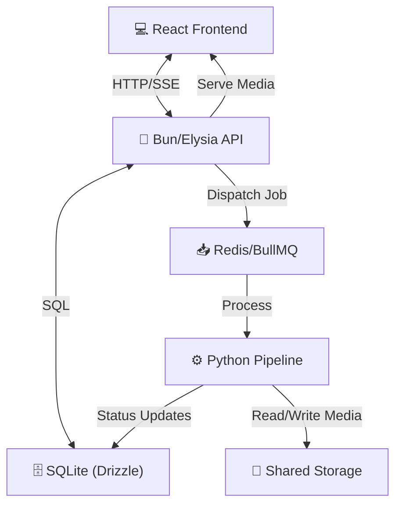

# 🏗️ Architecture: Content Repurposing Engine

## 🌟 The Big Picture

The **Content Repurposing Engine** is a high-performance, distributed AI platform designed to transform long-form video content into highly engaging, platform-ready short clips for **TikTok**, **YouTube Shorts**, and **Instagram Reels**.

It streamlines the workflow by automating:
*   **Transcription**: Converting speech to text.
*   **Viral Analysis**: Catching high-impact moments.
*   **Media Processing**: Vertical reframing and captioning.

---

## 🏗️ Core Architecture

The project is structured as a **Monorepo** with a decoupled, event-driven architecture that separates high-frequency API traffic from compute-intensive video processing.

### **System Diagram**

### **Project Structure**
*   **`client/`**: React SPA (Single Page Application) for management and preview.
*   **`server/`**: Lightweight orchestrator and API gateway.
*   **`workers/`**: Heavy-duty Python nodes specialized in ML and Video encoding.
*   **`storage/`**: Local or S3-compatible media bucket.

---

## 🔑 Key Components

### **1. Client (React + Vite)**
*   **Upload Portal**: Handles chunked uploads and YouTube URL parsing.
*   **Live Dashboard**: Real-time project tracking via **SSE (Server-Sent Events)**.

### **2. Server (Bun + Elysia)**
*   **Job Producer**: Dispatches work to background workers via **BullMQ**.
*   **Data Layer**: Persists metadata (timestamps, scores, states) using **Drizzle ORM**.
*   **Downloader API**: Serves direct raw YouTube media streams for standalone queries.

### **3. Workers (Python Engine)**
*   **Transcription**: Word-level timestamps via **Groq Cloud API** (Whisper Large V3).
*   **Viral Scoring**: Text-based semantic analysis using **LLMs** (Gemini or OpenAI).
*   **Visual Polish**: **FFmpeg** for 9:16 reframing and burning captions.
*   **Standalone Downloader**: Isolated `yt-dlp` background process for pure media ingestion on a separate BullMQ queue (`youtube-download`).

---

## 🔄 Data Flow & Pipeline Stages

When a video is submitted, it travels through an idempotent state machine:

| Stage | Activity | Output |
| :--- | :--- | :--- |
| **Ingestion** | File stored in `storage/uploads` | Raw Video |
| **Transcribe** | Groq API processes Audio -> Text | `transcript.json` |
| **Analyze** | LLM identifies "hooks" and viral segments | `analysis.json` |
| **Extract** | FFmpeg slices segments from original | Raw Clips |
| **Format** | Burn-in Captions + 9:16 Smart Crop | Final Clips |

---

## ⚡ Resource Intensity Breakdown

Processing a **1-hour video** (~216,000 frames) yields different bottlenecks at each phase:

| Phase | Intensity | Bottleneck | Why? |
| :--- | :--- | :--- | :--- |
| **Download** | 🟢 Low | Network | Pure bandwidth-limited transfer. |
| **Transcribe** | 🟡 Medium | API Speed / Network | Audio extraction and cloud API inference. |
| **Analysis** | 🟡 Medium | API Speed | Semantic text processing is relatively fast. |
| **Clipping** | 🟢 Low | Disk I/O | Metadata cutting without re-encoding. |
| **Polish** | 🟣 **Critical** | CPU/GPU | **Full re-encoding** of every modified pixel. |

---

## 🛠️ Tech Stack

*   **Runtime**: [Bun](https://bun.sh/) (Fastest JS runtime for IO-heavy services).
*   **Queue**: [BullMQ / Redis](https://docs.bullmq.io/) (Reliable job persistence).
*   **Media**: [FFmpeg](https://ffmpeg.org/) (The industry standard for video manipulation).
*   **AI**: **Groq API** (Transcription) & **Gemini/OpenAI** (Semantic extraction).

---

## 📝 Final Summary

The **Content Repurposing Engine** leverages a **Bun/Elysia** API server to orchestrate heavy-duty **Python** video processing workers. It successfully bridges the gap between high-level web interfaces and low-level media encoding, providing a scalable solution for modern content creators.
